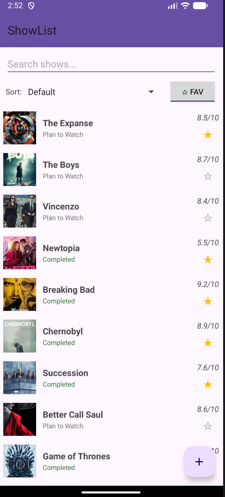
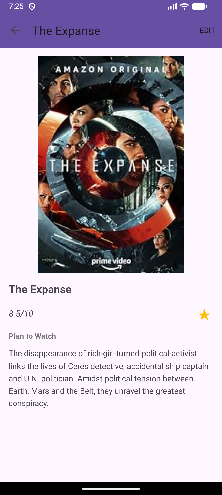
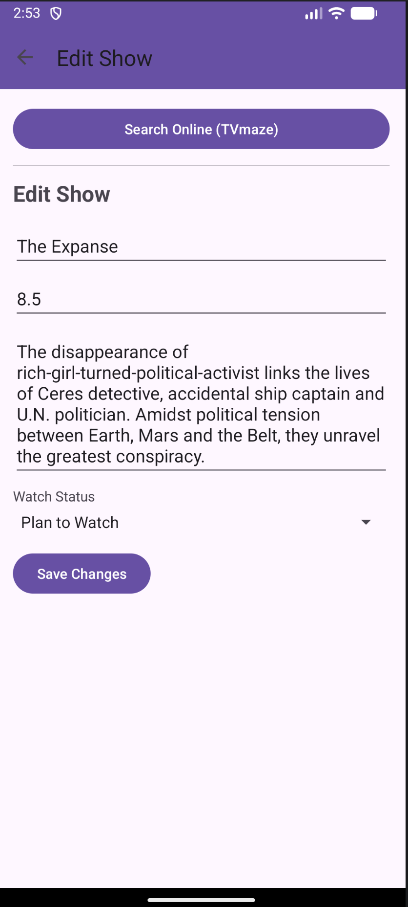
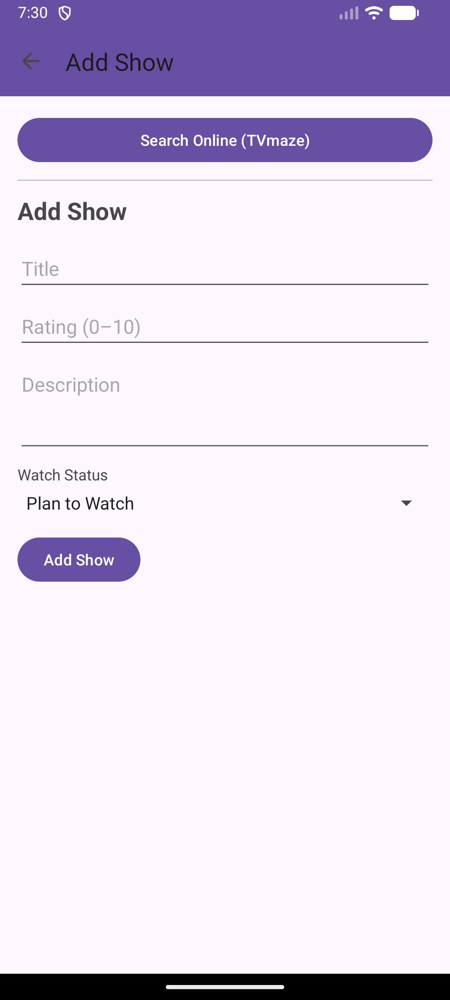
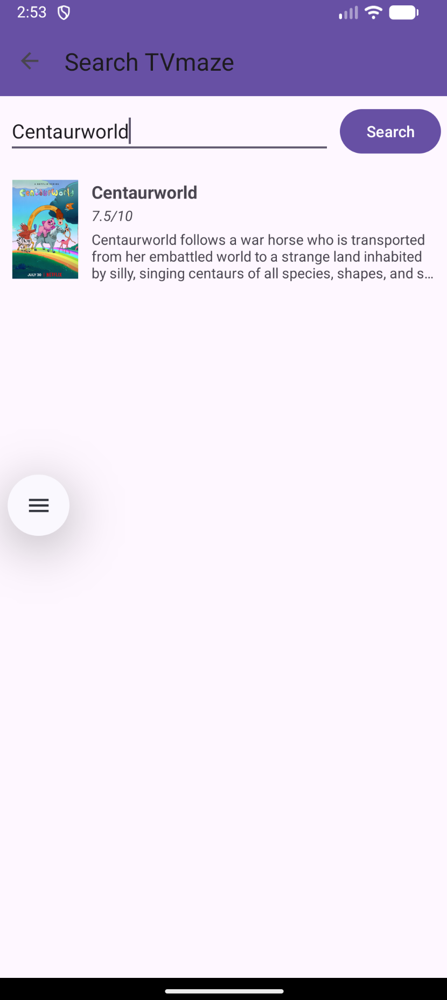

# Queued

Queued is an Android app for tracking TV shows. Search for shows directly from TVmaze, or add them manually. Track your watch status, rate shows, and mark favorites — all stored locally on your device with SQLite.

## Features

- **TVmaze Search** — Search the TVmaze database by name. Results include posters, ratings, and descriptions that auto-fill the add form.
- **Watch Status** — Tag each show as *Plan to Watch*, *Watching*, *Completed*, or *Dropped*, with color-coded labels throughout the app.
- **Favorites** — Star any show from the list or detail view. Filter the list to favorites only with the toggle button.
- **Search & Sort** — Filter your list in real time by title. Sort by default order, name (A–Z), rating (high to low), or status.
- **Add / Edit / Delete** — Add shows manually or from TVmaze. Long-press any show to edit or delete it.
- **Detail View** — Tap a show to see its full poster, rating, status, and description. Toggle favorite from this screen too.
- **Local Storage** — All data is stored on-device with SQLite. No account or internet connection required to use existing shows.

## Screenshots

<p align="center">
  
</p>

<table>
  <tr>
    <td align="center"><br/><sub>Main List</sub></td>
    <td align="center"><br/><sub>Detail View</sub></td>
    <td align="center"><br/><sub>Edit Show</sub></td>
    <td align="center"><br/><sub>Add Show</sub></td>
    <td align="center"><br/><sub>TVmaze Search</sub></td>
  </tr>
</table>

## Getting Started

### Demo
[Demo](https://appetize.io/app/b_6pdork34eiaei2tu6cignrfbgi)

### Prerequisites

- Android Studio
- Android device or emulator (API 21+)

### Installation

1. Clone the repository:
   ```sh
   git clone https://github.com/crypticwaffles/queued.git
   ```
2. Open the project in Android Studio.
3. Let Gradle sync the dependencies.
4. Build and run on an emulator or physical device.

## Tech Stack

| Layer | Technology |
|---|---|
| Language | Java |
| Min SDK | 21 (Android 5.0) |
| UI | Material Design 3, RecyclerView, AppCompatActivity |
| Database | SQLite via `SQLiteOpenHelper` |
| Networking | `HttpURLConnection` + `org.json` |
| Image loading | Glide 4.x |
| API | [TVmaze REST API](https://www.tvmaze.com/api) (free, no key required) |

## Project Structure

```
app/src/main/
├── java/com/prog/queued/
│   ├── ShowCategoryActivity.java   — Main list screen (search, sort, filter)
│   ├── ShowActivity.java           — Detail view for a single show
│   ├── AddShowActivity.java        — Add / edit form with TVmaze search button
│   ├── SearchShowActivity.java     — TVmaze search screen with results list
│   ├── DatabaseHelper.java         — SQLite schema, migrations, seed data
│   ├── ShowAdapter.java            — RecyclerView adapter for the main list
│   ├── SearchResultAdapter.java    — RecyclerView adapter for TVmaze results
│   ├── Show.java                   — Data model for a saved show
│   └── TvMazeApiClient.java        — TVmaze HTTP search client
│   └── TvMazeShow.java             — Data model for a TVmaze search result
└── res/
    ├── layout/                     — XML layouts for all screens and list items
    ├── drawable/                   — Icons and sample show images
    └── values/                     — Strings, colors, and Material 3 theme
```

## Database Schema

The SQLite database (`queued`) contains a single `SHOW` table:

| Column | Type | Notes |
|---|---|---|
| `_id` | INTEGER PK | Auto-increment |
| `TITLE` | TEXT | |
| `RATING` | REAL | 0.0 – 10.0 |
| `DESCRIPTION` | TEXT | |
| `IMAGE_RESOURCE_ID` | INTEGER | Drawable resource ID (pre-loaded shows) |
| `IMAGE_URL` | TEXT | Remote poster URL (TVmaze shows) |
| `STATUS` | TEXT | Plan to Watch / Watching / Completed / Dropped |
| `FAVORITE` | INTEGER | 0 or 1 |
